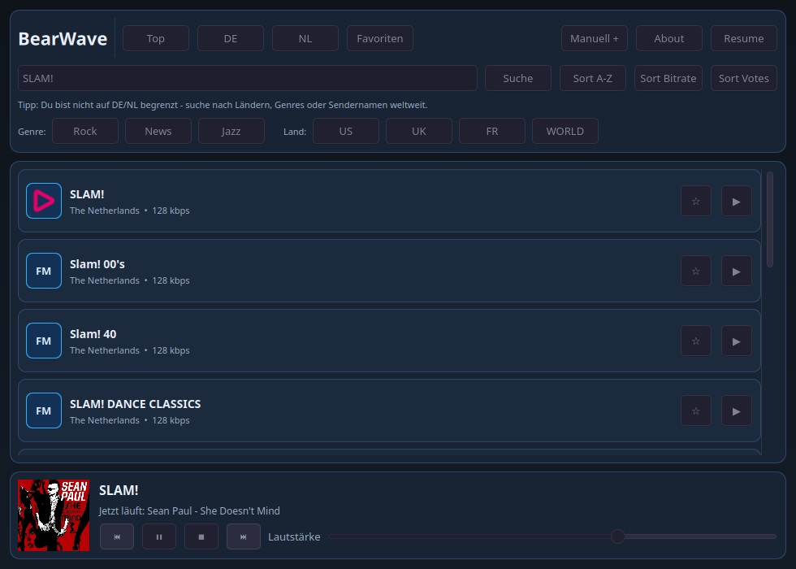
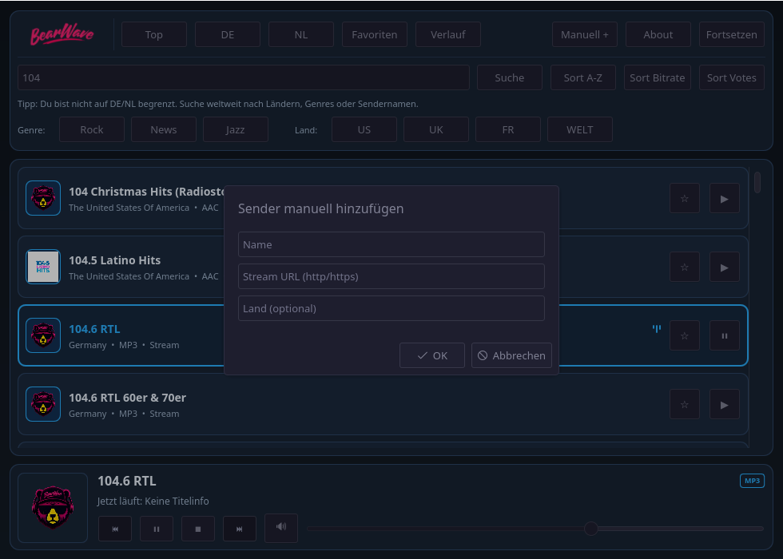
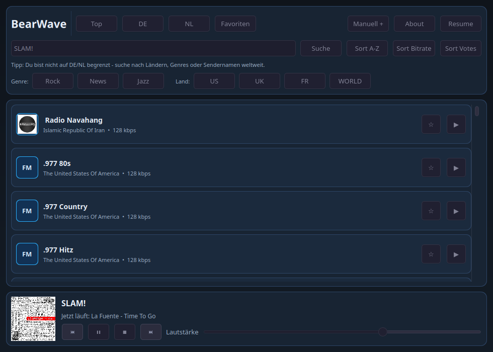
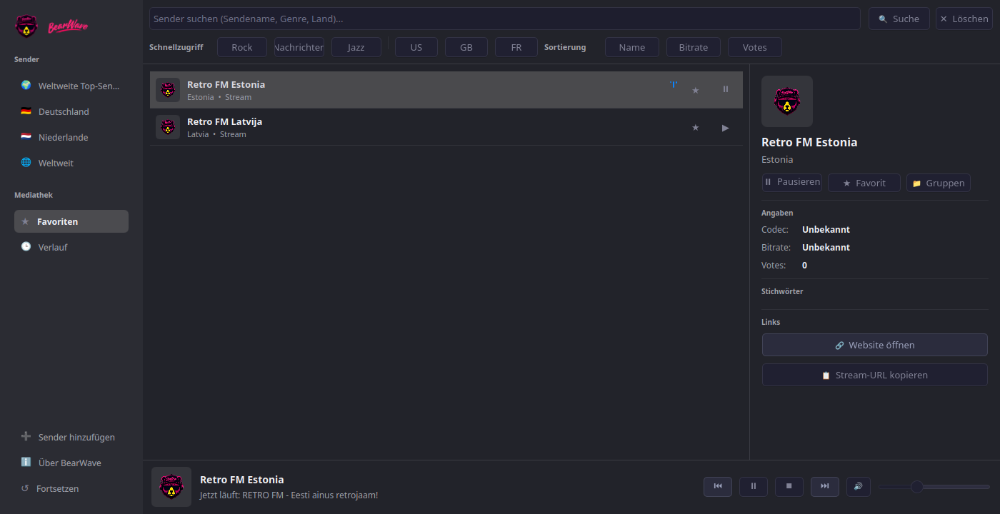
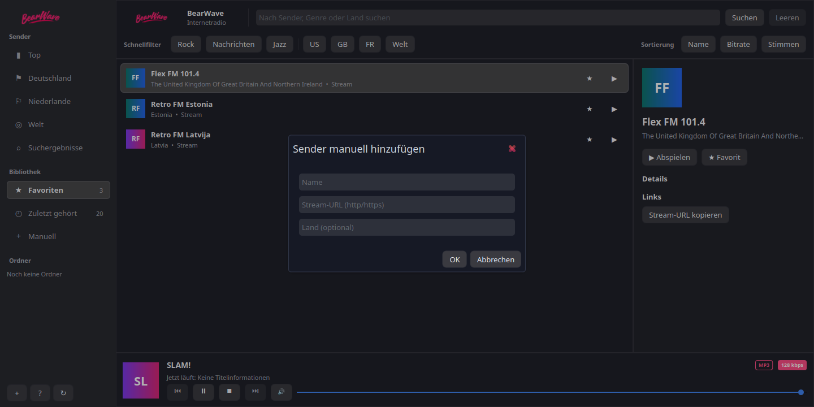

# BearWave

KDE-focused desktop internet radio app for Linux, built with Qt 6, QML, KDE Frameworks, and QtMultimedia.

BearWave is designed for fast station browsing, simple playback controls, favorites, resume support, tray behavior, and clean Plasma integration without turning into a heavy media suite.

[](https://github.com/spalencsar/bearwave/actions/workflows/build.yml)


## Screenshots

| Main window | Station browser |
| --- | --- |
|  |  |
|  |  |
|  | |

Screenshots: KDE Plasma on Linux.

### Demo Video
👉 [**Click here to watch the Demo Video**](https://github.com/spalencsar/bearwave/raw/main/screens/bearwave_demo.mp4)

---

## Quick Start

Three sensible paths right now:

### Option A: Arch Linux (AUR)

BearWave is officially available in the Arch User Repository as `bearwave-git`. You can easily install it using an AUR helper like `yay` or `paru`:

```bash
yay -S bearwave-git
```
*(Alternatively, you can build from the included `PKGBUILD` locally by running `makepkg -si`)*

### Option B: Local source build

```bash
cmake -S . -B build -DCMAKE_BUILD_TYPE=Release
cmake --build build -j"$(nproc)"
cmake --install build --prefix "$HOME/.local"
```

Then launch:

```bash
~/.local/bin/bearwave
```

### Option C: Flatpak (Universal / Immutable OS)

If you are running an immutable Linux distribution (like Fedora Silverblue, SteamOS) or simply prefer sandboxed applications, you can install BearWave directly from our independent repository:

```bash
# Add the BearWave repository
flatpak remote-add --user bearwave-repo https://flatpak.bearwave.app/bearwave.flatpakrepo

# Install the application
flatpak install bearwave-repo de.nerdbear.bearwave
```

## What BearWave Is

BearWave focuses on:

- KDE-first internet radio playback
- fast browsing via the Radio Browser API
- favorites and resume support
- lightweight desktop integration through tray + MPRIS
- straightforward local installation and operation

BearWave intentionally does not aim to be:

- a local music library manager
- a podcast client
- a broad cross-platform media application
- a feature-heavy all-purpose audio suite

## Features

- internet radio via the Radio Browser API with local JSON caching
- station pages for Top, Germany, Netherlands, and a dynamic World Categories dashboard
- interactive World View to search/browse stations by country flags and popular genre tags
- local search and filtering by name, genre, and country
- sorting by name, bitrate, and votes
- favorites with persistent local storage
- manual station add
- playback metadata display when streams provide it
- resume support for last station and volume
- MPRIS integration for Plasma media controls and media keys
- system tray integration for background playback
- desktop notifications for song/track changes with local cover art caching
- embedded About dialog with links and GNU GPLv3 license text

## Project Status

BearWave is an early public, source-first desktop project.

BearWave is currently in public beta and is best supported on Arch Linux and KDE Plasma.

It is already usable, but it should currently be treated as software for testers, contributors, and technically comfortable Linux users rather than a polished end-user release.

Current priorities:

- stability in normal playback flows
- predictable KDE/Plasma integration
- conservative packaging and installation behavior
- keeping the codebase small and maintainable

Current distribution status:

- source repository is the primary delivery format

## Platform And Support

BearWave is intentionally KDE-first.

- primary platform target: Linux
- primary desktop target: KDE Plasma 6
- primary development environment: Arch Linux
- other Linux distributions may build from source, but are not yet documented or tested to the same level

### Tested On

BearWave is currently aligned with and tested primarily against:

- Arch Linux
- KDE Plasma 6
- Qt 6
- KDE Frameworks 6
- Qt6 Multimedia

If support for other distributions becomes reliable, they should be added here explicitly instead of implied.

### Language Support

BearWave currently supports English and German.

- the application uses the system locale to select its UI language
- English is the base UI language
- German is provided as a bundled translation
- README, repository metadata, and development-facing material remain in English

If the system language is German, BearWave appears in German. Otherwise it falls back to English.

## Installation Status

BearWave should currently be understood as:

- officially documented for source builds
- most naturally aligned with Arch Linux packaging
- likely portable to other Linux distributions with Qt 6 / KF6 / QtMultimedia packages available
- not yet positioned as a broadly packaged consumer desktop app

If you want the least surprising path today, use either:

- a local source build
- the included Arch `PKGBUILD`

## Dependencies

### Arch Linux

```bash
sudo pacman -S cmake extra-cmake-modules qt6-base qt6-declarative qt6-tools \
  kirigami qt6-multimedia qt6-multimedia-ffmpeg
```

### KDE Neon / Ubuntu-based

```bash
sudo apt install cmake ninja-build qt6-base-dev qt6-declarative-dev qt6-tools-dev \
  libkf6kirigami-dev libkf6i18n-dev libkf6coreaddons-dev qt6-multimedia-dev
```

Note: exact package names can vary between distro releases, and non-Arch dependency sets should currently be treated as best-effort guidance rather than a guaranteed tested path.

## Build And Install

From the repository root:

```bash
cmake -S . -B build -DCMAKE_BUILD_TYPE=Release
cmake --build build -j"$(nproc)"
```

Optional local install:

```bash
cmake --install build --prefix "$HOME/.local"
update-desktop-database "$HOME/.local/share/applications"
kbuildsycoca6
```

This installs:

- binary: `~/.local/bin/bearwave`
- desktop file: `~/.local/share/applications/de.nerdbear.bearwave.desktop`
- icon: `~/.local/share/icons/hicolor/256x256/apps/de.nerdbear.bearwave.png`

Note: the generated desktop file uses the install prefix chosen during `cmake --install`.

If you want a clean rebuild:

```bash
rm -rf build
cmake -S . -B build -DCMAKE_BUILD_TYPE=Release
cmake --build build -j"$(nproc)"
```

## Runtime Requirements

- Linux desktop session
- KDE Plasma recommended
- Qt 6 runtime libraries
- Qt6 Multimedia backend (e.g. ffmpeg or gstreamer)
- network access to Radio Browser instances

## Usage

### Basic flow

1. Open a station page such as Top, DE, NL, Favorites, or a quick filter.
2. Select a station and start playback.
3. Add favorites for quick reuse.
4. Use Resume to continue from the last station and volume state.

### Keyboard shortcuts

- `Space`: play/pause
- `Ctrl+F`: focus search field

### Sorting

Sort station lists by:

- name
- bitrate
- votes

## Data And Persistence

BearWave stores user state under:

- favorites: `~/.config/bearwave/favorites.json`
- last station + volume: `~/.config/bearwave/state.json`
- API cache: `~/.cache/bearwave/api_cache/`
- cover art cache: `~/.cache/bearwave/covers/`

If these files are removed, app state resets to defaults or performs a fresh API sync.

## Plasma Integration

BearWave exposes playback through MPRIS, so it works with:

- Plasma media applets/widgets
- global media key handling
- external MPRIS-capable controllers

## Autostart

Enable autostart:

```bash
mkdir -p "$HOME/.config/autostart"
cp "$HOME/.local/share/applications/de.nerdbear.bearwave.desktop" "$HOME/.config/autostart/"
```

Disable autostart:

```bash
rm -f "$HOME/.config/autostart/de.nerdbear.bearwave.desktop"
```

## Troubleshooting

### No audio playback

- ensure `qt6-multimedia` and a backend like `qt6-multimedia-ffmpeg` or `gst-plugins-good` are installed
- test another station URL because some streams go offline

### App icon or launcher entry not updating

Re-run:

```bash
update-desktop-database "$HOME/.local/share/applications"
kbuildsycoca6
```

If desktop caches are stale, a logout/login cycle may still be required.

### Station list empty or slow

- verify internet connectivity
- Radio Browser may be temporarily rate-limited or degraded
- try another station category or filter

## Current Limitations

- packaging and install guidance are strongest on Arch Linux
- broader distro support is not yet validated to the same standard
- there are no official binary releases for non-technical end users yet

## Contributing

Issues and focused pull requests are welcome.

Before opening a larger change, it is worth checking whether it matches the project direction:

- KDE-first desktop behavior
- no unnecessary dependencies
- small, maintainable changes
- stability before feature breadth

See [CONTRIBUTING.md](CONTRIBUTING.md) for local build and review expectations.

## Development Notes

- main UI: `src/qml/Main.qml`
- backend orchestration: `src/radiobackend.cpp`
- stream playback: `src/bearplayer.cpp`
- API layer: `src/radiobrowser.cpp`
- MPRIS adapter: `src/mprisadaptor.cpp`
- desktop notifications: `src/notificationmanager.cpp`

For contributor and agent guardrails, see `AGENTS.md`.

## License

This project is licensed under the GNU GPL-3.0-or-later. See [LICENSE](LICENSE) for details.
