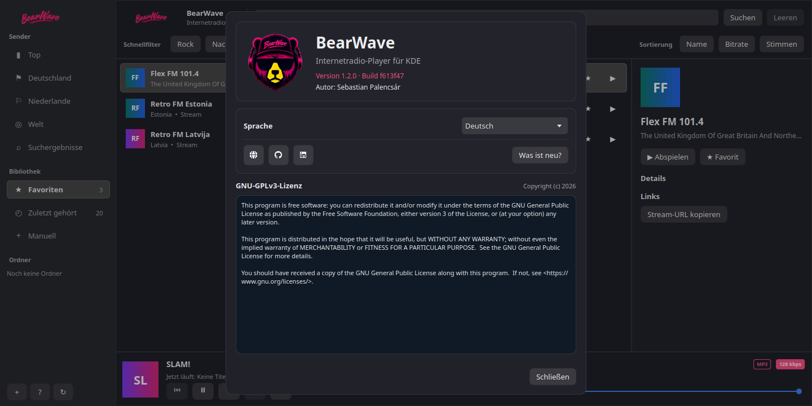

# BearWave

Desktop internet radio app for Linux, built with Qt 6, QML, and QtMultimedia.

BearWave is designed for fast station browsing, simple playback controls, favorites,
resume support, and tray behavior without turning into a heavy media suite. It runs
on common Linux desktops and integrates through Wayland, MPRIS, and the system tray.

[](https://github.com/spalencsar/bearwave/actions/workflows/build.yml)

-1f6feb)


**Current release:** [1.3.0](CHANGELOG.md#130---2026-08-10) (2026-08-10)

BearWave **1.3.0** is a multi-desktop UI release: Now Playing stage, My stations,
responsive transport, redesigned list/sidebar, universal Qt framing, and Flatpak
config persistence via XDG paths ([#7](https://github.com/spalencsar/bearwave/issues/7)).
See the [changelog](CHANGELOG.md#130---2026-08-10).

> **Android version:** BearWave is also available as a separate Android app
> with Android Auto and Google Cast support. See BearWave Android on
> [GitHub](https://github.com/spalencsar/bearwave-android) or
> [GitLab](https://gitlab.com/spalencsar/bearwave-android).

## Screenshots

| Main window                              | World browser                           |
| ---------------------------------------- | --------------------------------------- |
|  |  |
| Search and playback                      | Favorites                               |
|       |   |
| Add station                              | About and changelog                     |
|  |       |

Screenshots: Linux desktop.

### Demo Video

👉 [**Click here to watch the Demo Video**](https://github.com/spalencsar/bearwave/raw/main/screens/bearwave_demo.mp4)

---

## Quick Start

> [!CAUTION]
> ### Official Distribution & Security Notice
> We only guarantee the security and integrity of our official distribution channels:
> 1. **Our official Flatpak repository** (`https://flatpak.bearwave.app/`), which is GPG-signed by the author.
> 2. **Our official AUR package** (`bearwave-git`), where the source code is cloned directly from our official GitHub repository and built locally on your machine.
>
> We **do not verify, support, or guarantee** the security of any other third-party binary repositories (such as unofficial repositories on the openSUSE Build Service, private arch repositories, or other third-party package mirrors). Installing from unofficial sources carries security risks, as the binaries are not compiled or controlled by the original author.

Three sensible paths right now:

### Option A: Flatpak (Recommended)

For security (sandboxing) and ease of updates, we recommend installing BearWave from our independent, GPG-signed repository. This is also the ideal path for immutable distributions (like Fedora Silverblue or SteamOS) and on non-Arch distributions (e.g. Fedora with Plasma, Deepin with DDE).

**Prerequisite:** [Flatpak](https://flatpak.org/setup/) must be installed on your system. On many distributions it is already present; otherwise install it from your package manager first.

**Install (recommended):**

```bash
# One-step install from the signed Flatpak ref (adds the remote automatically)
flatpak install --from https://flatpak.bearwave.app/bearwave.flatpakref
```

The ref file is also included in this repository as [`bearwave.flatpakref`](bearwave.flatpakref).

Confirm the prompts when Flatpak asks to install the runtime and app. The first
install also pulls **org.kde.Platform 6.10** — that is Flatpak’s standard **Qt 6**
runtime (used by most Qt apps), not a requirement that you run KDE Plasma.

**Alternative (manual remote):**

```bash
flatpak remote-add --user bearwave-repo https://flatpak.bearwave.app/bearwave.flatpakrepo
flatpak install --user bearwave-repo de.nerdbear.bearwave
```

**Launch:**

```bash
flatpak run de.nerdbear.bearwave
```

After installation, BearWave should also appear in your application menu as `BearWave`.

**Update:**

```bash
flatpak update de.nerdbear.bearwave
```

**Uninstall:**

```bash
flatpak uninstall de.nerdbear.bearwave
# optional: remove the remote if you no longer need it
flatpak remote-delete bearwave-repo
```

**Notes:**

- BearWave is a single-instance app. Starting it again while it is already running raises the existing window instead of opening a second copy.
- **Runtime:** Flatpak builds against `org.kde.Platform` / `org.kde.Sdk` because that is the [documented Qt runtime](https://docs.flatpak.org/en/latest/qt.html) on Flathub (Qt modules + multimedia). There is no separate “Qt-only” platform for C++/QML apps. The app still does not depend on Plasma or KDE Frameworks at the application level.
- Sandbox permissions stay DE-neutral: network, GPU, Wayland/X11, PulseAudio, MPRIS, notifications, and StatusNotifier (system tray). StatusNotifier’s bus name is historically `org.kde.*` on Linux; that is a protocol name, not a Plasma dependency.
- If the UI behaves oddly right after an update, clear the Flatpak QML cache and restart:

```bash
rm -rf ~/.var/app/de.nerdbear.bearwave/cache/BearWave/BearWave/qmlcache
killall bearwave
flatpak run de.nerdbear.bearwave
```

### Option B: Arch Linux (AUR)

BearWave is available in the Arch User Repository as `bearwave-git`.

> [!WARNING]
> The AUR is community-driven and packages are not officially vetted. Always inspect the `PKGBUILD` and its source files before building/installing.

Install using an AUR helper like `yay` or `paru`:

```bash
yay -S bearwave-git
```

(Alternatively, you can build from the included `PKGBUILD` locally by running `makepkg -si`)

### Option C: Local source build

If you prefer building from source and having full control over compilation:

```bash
cmake -S . -B build -DCMAKE_BUILD_TYPE=Release
cmake --build build -j"$(nproc)"
cmake --install build --prefix "$HOME/.local"
```

Then launch:

```bash
~/.local/bin/bearwave
```

## What BearWave Is

BearWave focuses on:

- internet radio playback on the Linux desktop (Qt 6 only at runtime)
- fast browsing via the Radio Browser API
- favorites, **My stations** (manual URLs), and resume support
- responsive UI: Now Playing stage on wide layouts; works on short screens (e.g. 1440×900)
- lightweight desktop integration through tray + MPRIS
- Flatpak (recommended) and source/AUR install paths

BearWave intentionally does not aim to be:

- a local music library manager
- a podcast client
- a broad non-Linux media application
- a feature-heavy all-purpose audio suite

## Features

- internet radio via the Radio Browser API with local JSON caching
- station pages for Top, Germany, Netherlands, and a dynamic World Categories dashboard
- interactive World View to search/browse stations by country and popular genre tags
- local search and filtering by name, genre, and country
- sorting by name, bitrate, and votes
- favorites with persistent local storage (`~/.config/bearwave/favorites.json`)
- **My stations** for manual streams (`~/.config/bearwave/my_stations.json`)
- Now Playing stage with artwork, track metadata, and session ICY track history
- three transport layouts (stage dock / compact bottom strip / full player bar)
- system light/dark theme (`BEARWAVE_THEME=light|dark` override)
- visible connecting, buffering, retrying, paused, and unavailable states
- resume support for last station and volume
- MPRIS integration for desktop media controls and media keys
- system tray integration for background playback
- desktop notifications for song/track changes with local cover art caching
- quality-checked station logos with homepage discovery and initials fallbacks
- persistent language selection with bundled German, Dutch, and Russian UI
  translations
- embedded About dialog with release notes, links, and GNU GPLv3 license text

## Project Status

BearWave is a public, source-first desktop project. Flatpak (signed repo) and
Arch (AUR `bearwave-git` / source) are the primary install paths.

Current priorities:

- stability in normal playback flows
- reliable multi-desktop integration (MPRIS, tray, light/dark)
- conservative packaging (Flatpak first)
- keeping the codebase small and maintainable

## Platform And Support

BearWave targets the Linux desktop with Qt 6 only (no desktop-environment frameworks required at runtime).

- primary platform target: Linux
- primary development environment: Arch Linux
- Flatpak is the recommended path on non-Arch distributions
- other Linux distributions may build from source, but are not documented or tested to the same level

### Tested On

**Verified (manual testing):**

- Arch Linux (source build, AUR, primary development target)
- Fedora (Flatpak)
- Deepin + DDE (Flatpak)

**Expected (not yet verified here):**

- other distributions via Flatpak with a working Qt/Wayland or X11 session
- tiling and traditional desktops using MPRIS and StatusNotifier tray protocols

**Runtime stack:**

- Qt 6
- Qt6 Multimedia

Add distributions here only after explicit testing, not by assumption alone.

### Language Support

BearWave currently supports English, German, Dutch, and Russian UI text.

- the application uses the system locale to select its UI language
- English is the base UI language
- German, Dutch, and Russian are provided as bundled translations
- World country names are localized from bundled Unicode CLDR data for German, Dutch, and Russian
- country search accepts the localized name, the English API name, and the ISO country code
- README, repository metadata, and development-facing material remain in English

If no bundled UI translation matches the system language, BearWave falls back to English.
The language can be selected in the About dialog. BearWave stores the choice and
applies it on the next start.

For temporary local testing, the stored language can be overridden at startup:

```bash
./build/src/bearwave --language=ru  # Russian UI and country names
./build/src/bearwave --language=nl  # Dutch UI and country names
```

Close an already running BearWave instance first because the application otherwise raises that existing instance.

## Installation Status

BearWave should currently be understood as:

- officially documented for Flatpak, source builds, and Arch Linux (AUR)
- primarily developed on Arch Linux
- usable on other distributions via Flatpak or a local Qt 6 build
- not yet positioned as a broadly packaged consumer desktop app beyond the Flatpak repository

If you want the least surprising path today, use either:

- **Flatpak** on Fedora, immutable distros, or non-Arch systems
- a local source build or the included Arch `PKGBUILD` on Arch Linux

## Dependencies

### Arch Linux

```bash
sudo pacman -S cmake qt6-base qt6-declarative qt6-tools \
  qt6-multimedia qt6-multimedia-ffmpeg
```

### KDE Neon / Ubuntu-based

```bash
sudo apt install cmake ninja-build qt6-base-dev qt6-declarative-dev qt6-tools-dev \
  qt6-multimedia-dev
```

Note: exact package names can vary between distro releases, and non-Arch dependency sets should currently be treated as best-effort guidance rather than a guaranteed tested path.

## Build And Install

From the repository root:

```bash
cmake -S . -B build -DCMAKE_BUILD_TYPE=Release
cmake --build build -j"$(nproc)"
```

Optional local install:

```bash
cmake --install build --prefix "$HOME/.local"
update-desktop-database "$HOME/.local/share/applications"
kbuildsycoca6
```

When upgrading an older local installation, remove the obsolete PNG icon once
before refreshing the desktop cache:

```bash
rm -f "$HOME/.local/share/icons/hicolor/256x256/apps/de.nerdbear.bearwave.png"
```

This installs:

- binary: `~/.local/bin/bearwave`
- desktop file: `~/.local/share/applications/de.nerdbear.bearwave.desktop`
- icon: `~/.local/share/icons/hicolor/scalable/apps/de.nerdbear.bearwave.svg`

Note: the generated desktop file uses the install prefix chosen during `cmake --install`.

If you want a clean rebuild:

```bash
rm -rf build
cmake -S . -B build -DCMAKE_BUILD_TYPE=Release
cmake --build build -j"$(nproc)"
```

### Tests

From the build directory:

```bash
ctest --test-dir build --output-on-failure
```

This runs backend unit tests for playback navigation, API race handling, and manual station URL validation.

## Runtime Requirements

- Linux desktop session (Wayland or X11)
- Qt 6 runtime libraries
- Qt6 Multimedia backend (e.g. ffmpeg or gstreamer)
- network access to Radio Browser instances

## Usage

### Basic flow

1. Open a station page such as Top, DE, NL, Favorites, or a quick filter.
2. Select a station and start playback.
3. Add favorites for quick reuse.
4. Use Resume to continue from the last station and volume state.

### Keyboard shortcuts

- `Space`: play/pause
- `Ctrl+F`: focus search field

### Sorting

Sort station lists by:

- name
- bitrate
- votes

## Data And Persistence

BearWave stores user state under:

- favorites: `$XDG_CONFIG_HOME/bearwave/favorites.json` (native default: `~/.config/bearwave/`)
- my stations (manual): `…/bearwave/my_stations.json`
- last station + volume + recent: `…/bearwave/state.json`
- API cache: `$XDG_CACHE_HOME/bearwave/api_cache/`
- cover art cache: `$XDG_CACHE_HOME/bearwave/covers/`

Under **Flatpak**, config/cache live in the app sandbox
(`~/.var/app/de.nerdbear.bearwave/config/bearwave/` and `…/cache/bearwave/`)
and persist across restarts without host filesystem overrides.

The image cache is capped at 50 MiB. Entries that have not been used for more
than 30 days are removed automatically. Station logos shorter than 64 pixels
are replaced by a larger logo discovered from the station's official homepage,
or by a stable initials tile if discovery yields no suitable image. Track cover
art is handled separately and is not subject to the station-logo size limit.

If these files are removed, app state resets to defaults or performs a fresh API sync.

## Desktop Integration

BearWave exposes playback through MPRIS, so it works with:

- desktop media applets and shell media modules
- global media key handling
- external MPRIS-capable controllers

System light/dark preference is followed when the environment provides it
(xdg-desktop-portal, gsettings, or Qt). Override with `BEARWAVE_THEME=light|dark`.

### Responsive transport

| Window | Right stage | Bottom bar |
|--------|-------------|------------|
| Wide + tall (`≥1240` × `≥960`) | Now Playing + transport dock | hidden |
| Wide + short (e.g. 1440×900) | Now Playing (compact cover) | transport-only strip |
| Narrow (`<1240`) | hidden | full player bar |

## Autostart

Enable autostart:

```bash
mkdir -p "$HOME/.config/autostart"
cp "$HOME/.local/share/applications/de.nerdbear.bearwave.desktop" "$HOME/.config/autostart/"
```

Disable autostart:

```bash
rm -f "$HOME/.config/autostart/de.nerdbear.bearwave.desktop"
```

## Troubleshooting

### Flatpak install or update fails

- verify Flatpak is installed: `flatpak --version`
- retry the one-step install: `flatpak install --from https://flatpak.bearwave.app/bearwave.flatpakref`
- if the remote already exists: `flatpak remote-modify --user bearwave-repo --url=https://flatpak.bearwave.app/bearwave.flatpakrepo`
- check installed build: `flatpak info de.nerdbear.bearwave`
- signature errors usually mean the repository on the server is out of date; retry later or report an issue

### Flatpak: no audio playback

- ensure PulseAudio or PipeWire with PulseAudio compatibility is running (the Flatpak uses `--socket=pulseaudio`)
- test another station URL because some streams go offline
- confirm you are running the Flatpak build, not a leftover source/AUR binary: `which bearwave` vs `flatpak run de.nerdbear.bearwave`

### No audio playback (source / AUR build)

- ensure `qt6-multimedia` and a backend like `qt6-multimedia-ffmpeg` or `gst-plugins-good` are installed
- test another station URL because some streams go offline

### App icon or launcher entry not updating

Re-run:

```bash
update-desktop-database "$HOME/.local/share/applications"
kbuildsycoca6
```

If desktop caches are stale, a logout/login cycle may still be required.

### Station list empty or slow

- verify internet connectivity
- Radio Browser may be temporarily rate-limited or degraded
- try another station category or filter

## Current Limitations

- packaging and install guidance are strongest on Arch Linux
- Flatpak works on non-Arch distributions; verified so far: Fedora and Deepin (DDE)
- the app uses its own Qt/QML look rather than each desktop’s native widget theme
- there are no official binary releases beyond the Flatpak repository for non-technical end users yet

## Contributing

Issues and focused pull requests are welcome.

Before opening a larger change, it is worth checking whether it matches the project direction:

- Qt-only desktop app for Linux (no DE framework required)
- no unnecessary dependencies
- small, maintainable changes
- stability before feature breadth

See [CONTRIBUTING.md](CONTRIBUTING.md) for local build and review expectations.

## Development Notes

- main UI shell: `src/qml/Main.qml`
- QML components: `src/qml/components/` (navigation, search, station cards, player bar, dialogs)
- theme singleton: `src/qml/theme/BearTheme.qml`
- backend orchestration: `src/radiobackend.cpp`
- stream playback: `src/bearplayer.cpp`
- API layer: `src/radiobrowser.cpp`
- MPRIS adapter: `src/mprisadaptor.cpp`
- desktop notifications: `src/notificationmanager.cpp`
- unit tests: `tests/`
- Flatpak manifest: `de.nerdbear.bearwave.json` (`org.kde.Platform` 6.10 = Qt 6 stack)
- Control D-Bus interface: `de.nerdbear.BearWave.Control` (on the MPRIS object)

### Building the Flatpak locally

Requires `flatpak-builder` and the KDE 6.10 SDK/runtime from Flathub:

```bash
flatpak install -y flathub org.kde.Sdk//6.10 org.kde.Platform//6.10
# signed repo build (needs the project GPG key); see scripts/build-flatpak.sh
./scripts/build-flatpak.sh
```

See [CHANGELOG.md](CHANGELOG.md) for release history. For contributor and agent guardrails, see `AGENTS.md`.

## License

This project is licensed under the GNU GPL-3.0-or-later. See [LICENSE](LICENSE) for details.
